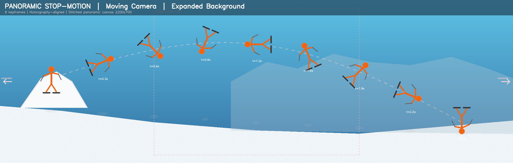

# Video → Stop-Motion Effect | Sports Analysis Tool

Transform video clips into stop-motion composite images that show a subject's full movement trajectory in a single frame — ideal for sports analysis, coaching, and biomechanics study.

**Supports both static and moving cameras** — moving camera footage is automatically aligned and stitched into an expanded panoramic background.



## How It Works

### Moving Camera (default)

1. **Import a video** of an athlete performing a movement (filmed with a panning/tracking camera)
2. **Select a time section** — a couple of seconds covering the key action
3. **Align & stitch** — frames are aligned via ORB feature matching + affine transforms, then stitched into a wide panoramic background
4. **Pick keyframes** — automatically (based on movement detection in panorama coordinates) or uniformly spaced
5. **Generate composite** — the subject is segmented from each keyframe and composited onto the expanded panoramic canvas

The result is an image **wider than any single video frame**, showing the full trajectory across the scene.

### Static Camera

For tripod/fixed camera footage, uses pixel-wise median to estimate a clean background, then segments and composites the subject at each keyframe.

## Installation

```bash
# Clone the repository
git clone https://github.com/szetszho/video2stopmotion.git
cd video2stopmotion

# Install dependencies
pip install -r requirements.txt
```

### Dependencies

- Python 3.10+
- OpenCV (`opencv-python`)
- NumPy
- Pillow
- Gradio (for the web UI)
- scikit-image

## Usage

### Launch the Web UI

```bash
python app.py
```

Then open `http://localhost:7860` in your browser.

### Workflow

| Step | Action |
|------|--------|
| 1 | Choose camera mode (Moving or Static) |
| 2 | Upload a video file (MP4, AVI, MOV, etc.) |
| 3 | Set start/end times to select the action section |
| 4 | *(Moving Camera)* Click "Align & Build Panorama" to stitch the background |
| 5 | Choose keyframes (auto or uniform) and preview |
| 6 | Adjust parameters and generate the composite |
| 7 | Preview and download the full-resolution result |

### Parameters

| Parameter | Description | Default |
|-----------|-------------|---------|
| **Camera Mode** | `Moving Camera` (panoramic stitching) or `Static Camera` (median bg) | Moving |
| **Number of Keyframes** | How many subject poses to include (3–15) | 7 |
| **Selection Mode** | `Auto` (movement-based) or `Uniform` spacing | Auto |
| **Detection Sensitivity** | Higher = detects subtler movements | 30 |
| **Background Method** | `median` (removes subject) or `overlay` (faster) | median |
| **Segmentation Threshold** | Lower = more sensitive foreground detection | 35 |
| **Morph Kernel Size** | Cleanup kernel for mask edges | 7 |
| **Subject Opacity** | Transparency of each subject layer | 1.0 |
| **Drop Shadow** | Adds shadow behind each subject | On |

## Tips for Best Results

- **Moving camera**: Ensure there's enough texture in the background for feature matching (buildings, trees, terrain). Smooth uniform backgrounds may cause alignment issues.
- Keep the **subject moving** across the frame (not just in place)
- A section of **1–3 seconds** usually works best
- Higher contrast between subject and background gives better segmentation
- Adjust the segmentation threshold if the subject isn't cleanly extracted
- For **very long pans**, the affine alignment keeps the panorama geometrically stable

## Architecture

```
video2stopmotion/
├── app.py                # Gradio web UI (both camera modes)
├── video_processor.py    # Core processing engine
├── generate_example.py   # Generates synthetic example images
├── requirements.txt      # Python dependencies
├── example_output.png    # Example panoramic composite
└── README.md
```

### Core Modules (`video_processor.py`)

- `VideoProcessor` — Video loading, frame extraction, metadata
- `PanoramicPipeline` — End-to-end moving camera workflow (align → stitch → segment → composite)
- `compute_direct_homographies()` — Direct-to-reference affine alignment (avoids chain drift)
- `build_panoramic_background()` — Stitch aligned frames into expanded panorama with median blending
- `segment_foreground_moving()` — Warp frame to panorama coords + background subtraction
- `estimate_background()` — Pixel-wise median background (static camera)
- `segment_foreground()` — Background subtraction + morphological cleanup (static camera)
- `composite_stop_motion()` — Layer subjects onto clean background with drop shadows
- `auto_select_keyframes_moving()` — Centroid-based keyframe selection in panorama coordinates

## License

See [LICENSE](LICENSE) for details.
